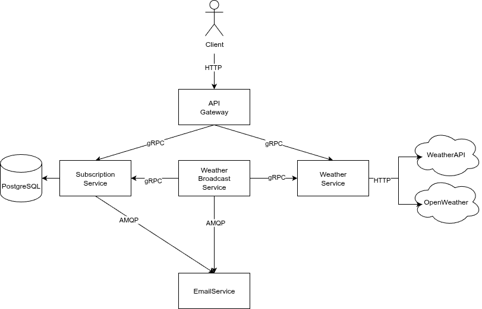

# Microservice Separation Plan

## Microservice Architecture Diagram

  

## Microservice Description

### API Gateway
---
Це точка входу додатку, що приймає наступні HTTP запити від клієнта:
- **GET** / -  отримання HTML-сторінки для підписки  
- **GET** /weather  - отримння погоди
- **POST** /subscribe - створення підписки
- **GET** /confirm/{token}  - підтвердження підписки
- **GET** /unsubscribe/{token} - видалення підписки

Функції:
- Маршрутизація запитів до відповідних мікросервісів
- Віддає статичну HTML-сторінку для підписки

Взаємодії:
- Запити на створення, підтвердження та видалення підписки перенаправляються на Subscription Service, використовуючи протокол комунікації gRPC.
- Запити на отримання погоди перенаправляються до Weather Service також за допомогою gRPC.

### Subscription Service

---

Цей сервіс відповідає за всю бізнес-логіку пов'язану з підписками.

Функції:
- Створення нових підписок у базі даних
- Генерація та валідація токенів
- Підтвердження підписок
- Видалення підписок
- Надання списку активних підписок для розсилки

Взаємодії:
- Публікує івенти в RabbitMQ для відправки повідомлень про підписку та її підтвердження через Email Service
- Публікує івенти в RabbitMQ для перевірки емейлу на існування через Email Service

### Weather Service
---
Сервіс відповідальний за отримання актуальної погодної інформації.

Функції:
- Інтеграції з зовнішніми погодними API для отримання погоди
- Кешування результатів запитів до звонішніх API в Redis

Взаємодії:
- Використовує HTTP для звернення до зовнішніх погодних API

### Weather Broadcast Service
---
Цей сервіс відповідальний за регулярну розсилку актуальної погоди на пошту користувачам.

Функції:
- Щогодинна розсилка погоди
- Щоденна розсилка погоди
- Координація між сервісами для отримання підписок та погодних даних

Взаємодії:
- Використовує gRPC для отримання списку підписок від Subscription Service
- Використовує gRPC для отримання погодних даних від Weather Service
- Публікує івенти в RabbitMQ для відправки оновлень погоди через Email Service

